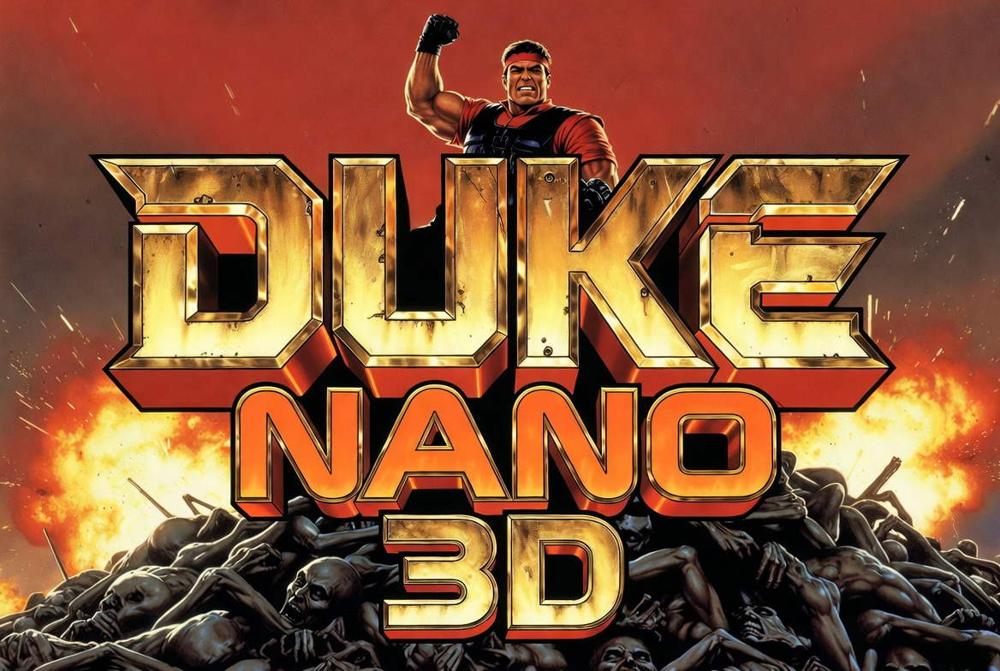

# DukeNano3D
Tiny versions of Duke Nukem 3D GRP files, for devices with limited storage and RAM like duke3d-go in retro-go on the ESP32 microcontroller.

## Results

Original file is the official Duke Nukem 1.3D Shareware, and all "reduction in %" are compared to that original.

| Version | Size in Bytes | Reduction in % | Size in Bytes Zipped | Reduction in % |
| --- | --- | --- | --- | --- |
| Original DUKE3D_v1.3d_shareware.grp | 11035779 | 0% | 4875659 | 55% |
| E1L1-6.grp | 4900392 | 55.60% | 3486533 | 68.41% |
| E1L1-6_compromise.grp | 3753280 | 65.99% | 2578160 | 76.64% |
| E1L1-6_tiny.grp | 3250261 | 70.55% | 2124110 | 80.75% |
| E1L1-2_compromise.grp | 2366442 | 78.56% | 1761799 | 84.04% |
| E1L1_compromise.grp | 2306532 | 79.10% | 1777093 | 83.90% |
| E1L1_tiny.grp | 1803513 | 83.66% | 1320180 | 88.04% |
| E1L1_minimal.grp | 1772572 | 83.94% | 1295342 | 88.26% |

## Required tools

Core:

- Python 3
- EDuke32 tooling: `kextract`, `kgroup`, `arttool`, `mapinfo`
- ImageMagick `convert`

Optional (depending on flags/workflow):

- `optipng` (for `--optipng`)
- `zopflipng` (for `--zopflipng`)
- `ffmpeg` (for `--adpcmwav` / `--adpcmwidth` workflows)
- `adpcm-xq` (for `--adpcmwidth`)
- `zip` (for making `.grp.zip` files)

## How to run

Build compact GRP variants:

```bash
python3 duke3d_compact_grp.py
```

Run the generated GRP in EDuke32 (from `eduke32-for-DukeNano3D/runit.sh`):

```bash
./eduke32 -usecwd -g newfile.grp -l2
```

Also see compact.sh and generate_variants.sh for example arguments.

## Work done

The actual work of compressing a GRP file is done by `duke3d_compact_grp.py` which includes:

- extracting GRP file using EDuke32's kextract
- extracting TILESNNN.ART files using EDuke32's arttool
- analysing .MAP files to find out which textures and .MID(i) files it needs
- converting .pcx texture images to .png using Imagemagick's `convert`
- compressing .png files using `optipng` and `zopflipng`
- converting .VOC (raw PCM audio) to .WAV files using `ffmpeg`
- converting .WAV files to ADPCM-compressed .WAV files using adpcm-xq (which supports 2 to 5-bit width)
- bundling the files into a new GRP file using EDuke32's kgroup

Optional Zipping of the .grp file is done with a simple `zip -9 out.grp.zip out.grp`

### EDuke32 fork

- already supports PNG textures (duke3d.def `[definetexture](https://wiki.eduke32.com/wiki/Tilefromtexture_(DEF))`)
- already supports WAV sound effects (duke3d.def `[sound](https://wiki.eduke32.com/wiki/Sound_(DEF))`)
- already supports anim(ations) from tile ranges (duke3d.def `[animtilerange](https://wiki.eduke32.com/wiki/Animtilerange_(DEF))`)

- didn't support ADPCM compressed WAV sound effects => added this

###  duke3d-go

The duke3d-go on an experimental branch of retro-go was extended to support:

- EDuke32-style PNG texture override
- EDuke32-style WAV sound effects
- EDuke32-style anim(ations) from tile ranges (duke3d.def `[animtilerange](https://wiki.eduke32.com/wiki/Animtilerange_(DEF))`) => added this
- ADPCM compressed WAV sound effects
-
## Git submodule workflow

This repository tracks the following Git submodules:

- `eduke32-for-DukeNano3D`
- `retro-go-for-DukeNano3D` (tracks branch `Duke3D-with-fri3d-2026`)

### Clone with submodules (recommended)

```bash
git clone --recursive https://github.com/ThomasFarstrike/DukeNano3D.git
```

If you already cloned without `--recursive`:

```bash
git submodule update --init --recursive
```

### Sync submodule URLs/config from `.gitmodules`

Run this if `.gitmodules` changed (for example, after upstream URL updates):

```bash
git submodule sync --recursive
git submodule update --init --recursive
```

### Update submodules to latest remote commit on their tracked branches

To move all submodules to the latest commit of their tracked branch:

```bash
git submodule update --remote --merge --recursive
```

Or update only one submodule:

```bash
git submodule update --remote --merge eduke32-for-DukeNano3D
git submodule update --remote --merge retro-go-for-DukeNano3D
```

Then commit updated submodule pointers in the superproject:

```bash
git add .gitmodules eduke32-for-DukeNano3D retro-go-for-DukeNano3D
git commit -m "Update submodules"
```
