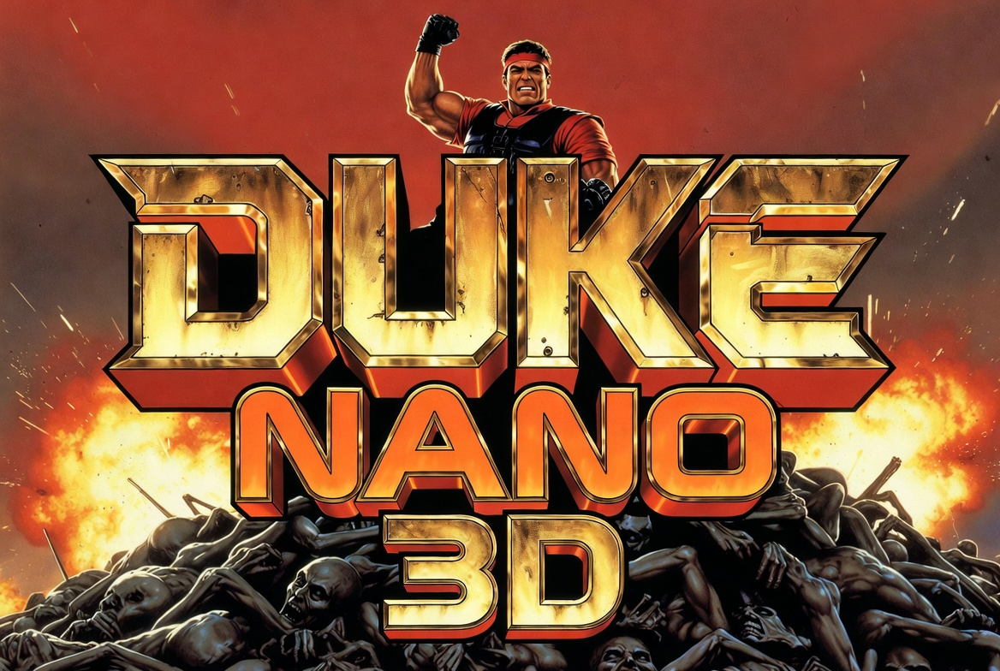

# DukeNano3D

Compact Duke Nukem 3D 1.3D Shareware `.grp` variants for constrained targets (e.g. `duke3d-go` in `retro-go` on ESP32-class devices).

## Results

| Version | Size (KiB) | Reduction in % | Size Zipped (KiB) | Reduction in % |
| --- | --- | --- | --- | --- |
| DUKE3D_v1.3d_shareware.grp | 10777.1 | 0% | 4729.2 | 56.12% |
| E1L1-6.grp | 3788.6 | 64.85% | 2655.0 | 75.36% |
| E1L1-6_nearcomplete.grp | 3594.6 | 66.65% | 2470.6 | 77.08% |
| E1L1-6_compromise.grp | 3018.5 | 71.99% | 1961.3 | 81.80% |
| E1L1-3_nearcomplete.grp | 2805.4 | 73.97% | 2072.7 | 80.77% |
| E1L1-6_tiny.grp | 2691.7 | 75.02% | 1595.3 | 85.20% |
| E1L1-2.grp | 2617.9 | 75.71% | 2026.0 | 81.20% |
| E1L1-4_compromise.grp | 2543.9 | 76.40% | 1720.9 | 84.03% |
| E1L1-4_heavycompromise.grp | 2502.0 | 76.78% | 1683.1 | 84.38% |
| E1L1-2_nearcomplete.grp | 2460.2 | 77.17% | 1874.5 | 82.61% |
| E1L1-3_compromise.grp | 2298.5 | 78.67% | 1627.2 | 84.90% |
| E1L1.grp | 2254.2 | 79.08% | 1762.3 | 83.65% |
| E1L1-2_compromise.grp | 1991.8 | 81.52% | 1465.0 | 86.41% |
| E1L1_compromise.grp | 1687.6 | 84.34% | 1254.5 | 88.36% |
| E1L1_tiny.grp | 1444.3 | 86.60% | 968.3 | 91.02% |
| E1L1_minimal.grp | 1395.4 | 87.05% | 924.8 | 91.42% |

Notes:

- Baseline is `input/DUKE3D_v1.3d_shareware.grp`. Both "Reduction in %" columns are compared to that same unzipped baseline.
- Output sizes will vary slightly based on PNG compressor settings, PNG cache used, and tool versions. The above values are from a run using the precalculated PNG caches described in `longrun.sh`.
- See `generate_variants.sh` for the exact per-variant arguments.

### Regenerate the table

```bash
python3 compare_output_to_input_sizes.py --input input/DUKE3D_v1.3d_shareware.grp --outputs outputs
```

## Requirements

Core:

- Python 3
- EDuke32 tooling: `kextract`, `kgroup`, `arttool`, `mapinfo`
- ImageMagick (`convert`)

Optional (depending on flags/workflow):

- `zopflipng` (for `--zopflipng`)
- `pngquant` (for `--pngquant`)
- `ffmpeg` (for `--adpcmwav` / `--adpcmwidth` workflows)
- `adpcm-xq` (for `--adpcmwidth`)
- `zip` (for `.grp.zip` output)

## Quick start

Build a single compact variant:

```bash
python3 duke3d_compact_grp.py input/DUKE3D_v1.3d_shareware.grp
```

Build the full variant set:

```bash
./generate_variants.sh
```

Run a generated GRP in EDuke32:

```bash
./eduke32 -usecwd -g myvariant.grp -l2
```

## How it works

`duke3d_compact_grp.py` performs the main pipeline:

- Extracts GRP content using EDuke32 `kextract`.
- Extracts tile data from `TILESNNN.ART` using `arttool`.
- Analyzes `.map` files to determine needed textures and MIDI files.
- Converts `.pcx` textures to `.png` with ImageMagick `convert`.
- Optionally color-reduces PNGs via `pngquant` (`--pngquant quality_range`).
- Optionally optimizes PNGs with `zopflipng` (`--zopflipng`).
- Converts `.voc` audio to `.wav` with `ffmpeg`.
- Optionally recompresses WAV to ADPCM via `adpcm-xq` (`--adpcmwidth` 2–5 bits).
- Rebuilds the final GRP with EDuke32 `kgroup`.

Optional zipped output:

```bash
zip -9 out.grp.zip out.grp
```

Key CLI flags:

- `--maxsoundsize N` — exclude sound files larger than N bytes (raw VOC size).
- `--excludefiles FILE` — exclude specific files.
- `--includefiles FILE` — force-include files even if excluded by `--maxsoundsize`.
- `--pngquant QUALITY` — e.g. `40-71`, `10` for aggressive color reduction.
- `--pngfolder DIR` — reuse precalculated PNGs from a previous `--keep-temp` run.
- `--adpcmwav` / `--adpcmwidth N` — convert WAVs to ADPCM.
- `--camerasdestructable` — make security cameras destructible in game logic.
- `--ultraminimalmenu` — strip high-res menu images.
- `--nomenusongs` — exclude menu background music.
- `--keep-temp` — do not delete `temp_folder/` after the run (to seed a PNG cache).

### EDuke32 fork

Already supports:

- PNG textures via `duke3d.def` [`definetexture`](https://wiki.eduke32.com/wiki/Tilefromtexture_(DEF))
- WAV sound effects via `duke3d.def` [`sound`](https://wiki.eduke32.com/wiki/Sound_(DEF))
- Tile range animation via `duke3d.def` [`animtilerange`](https://wiki.eduke32.com/wiki/Animtilerange_(DEF))

Added in this fork:

- ADPCM-compressed WAV sound effect support

### duke3d-go (retro-go branch)

Extended support includes:

- EDuke32-style PNG texture overrides
- EDuke32-style WAV sound effects
- EDuke32-style `animtilerange` handling
- ADPCM-compressed WAV sound effects

## Git submodule workflow

This repository tracks:

- `eduke32-for-DukeNano3D`
- `retro-go-for-DukeNano3D` (branch `Duke3D-with-fri3d-2026`)

Clone with submodules (recommended):

```bash
git clone --recursive https://github.com/ThomasFarstrike/DukeNano3D.git
```

If already cloned without `--recursive`:

```bash
git submodule update --init --recursive
```

Sync URL/config after `.gitmodules` updates:

```bash
git submodule sync --recursive
git submodule update --init --recursive
```

Update submodules to latest tracked remote commit:

```bash
git submodule update --remote --merge --recursive
```

Update one submodule only:

```bash
git submodule update --remote --merge eduke32-for-DukeNano3D
git submodule update --remote --merge retro-go-for-DukeNano3D
```

Commit updated submodule pointers in this superproject:

```bash
git add .gitmodules eduke32-for-DukeNano3D retro-go-for-DukeNano3D
git commit -m "Update submodules"
```

## Future work

### Excluding textures

1) Currently, all textures for a selected level set are included. If a required texture is missing, rendering artifacts appear (undrawn areas/"dragging"). One possible approach is to replace large textures with tiny placeholder PNGs (~200 bytes) that preserve dimensions and approximate average color. That could enable a future `--maxtexturesize` option similar to `--maxsoundsize`.

2) Some textures are not directly referenced in map sectors/walls but are still required (HUD, weapon sprites, kick animation, decorative animations). Better static analysis of `.con` game logic could identify what can safely be removed.

### Excluding sound effects

Current options:

- `--excludefiles` for explicit sound file exclusions
- `--includefiles` to override `--maxsoundsize` exclusions for must-have sounds
- `--maxsoundsize` to skip all sound files larger than a threshold

Future improvement: smarter `.map` + `.con` usage analysis to remove unused or rarely used `.voc` assets while preserving gameplay quality.
